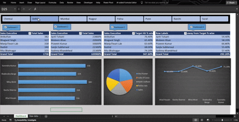
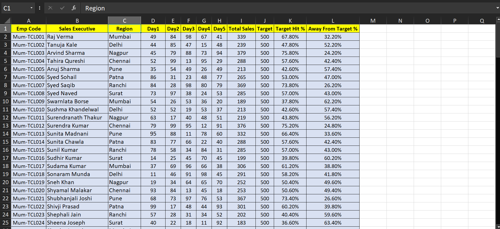

# Excel Dashboard with VBA Automation

## Overview

This project is an interactive Excel Dashboard developed using **Microsoft Excel, Pivot Tables, Pivot Charts, and VBA (Visual Basic for Applications)**. The dashboard provides a user-friendly interface for analyzing and visualizing business data through dynamic reports and charts.

A key feature of this project is the implementation of **VBA-powered checkboxes**, allowing users to dynamically show or hide dashboard components and customize the dashboard view without manually modifying the workbook.

---

## Project Demo

### Dashboard Walkthrough Video

Watch the complete dashboard demonstration below:




> The demo showcases city-wise filtering, interactive charts, automated reporting, and VBA-powered checkbox functionality.


---

## Raw Data Sample

The dashboard is built on structured Excel data and automatically generates reports through Pivot Tables and VBA automation.

### Sample Dataset



Features of the source dataset:

* Employee-wise performance data
* City-wise sales records
* KPI and target metrics
* Reporting and analytical information
* Structured format suitable for Pivot Table analysis

---

## Features

* Interactive Excel Dashboard with professional UI design
* VBA-enabled checkbox functionality for dynamic dashboard control
* Automated show/hide of dashboard sections using VBA macros
* Pivot Tables for data summarization and analysis
* Pivot Charts for visual representation of key metrics
* City-wise filtering and data exploration
* Dynamic reporting with minimal manual intervention
* User-friendly navigation and dashboard customization

---

## VBA Functionality

The dashboard uses **VBA CheckBox controls** to provide an interactive experience.

### Key VBA Features

* Enable or disable specific dashboard panels
* Show or hide reports and charts dynamically
* Improve dashboard readability by displaying only selected insights
* Reduce clutter and allow focused data analysis
* Automated worksheet interactions without manual formatting changes

### Example Workflow

* Chart 1 ✓ → Display Sales Summary
* Chart 2 ✓ → Display Performance Metrics
* Chart 3 ✓ → Display Target Achievement Analysis
* Chart 4 ✓ → Display Additional KPI Reports

The visibility of dashboard components is controlled automatically through VBA event-driven programming.

---

## Technologies Used

* Microsoft Excel
* VBA (Visual Basic for Applications)
* Pivot Tables
* Pivot Charts
* Form Controls (CheckBoxes)
* Data Validation
* Conditional Formatting

---

## Dashboard Highlights

### Interactive Controls

* City selection buttons
* VBA-powered checkboxes
* Dynamic report visibility

### Data Visualization

* Bar Charts
* Pie Charts
* Line Charts
* KPI Summary Tables

### Automation

* Dashboard customization through VBA
* Automated user interactions
* Dynamic report generation

---

## Project Structure

```text
Excel-Dashboard-VBA/
│
├── Dashboard.xlsm
│
├── demo/
│   └── dashboard-demo.mp4
│
├── screenshots/
│   ├── dashboard-main.png
│   ├── dashboard-checkbox.png
│   ├── dashboard-charts.png
│   └── raw-data.png
│
└── README.md
```

---

## Skills Demonstrated

* Excel Dashboard Development
* VBA Programming
* Data Visualization
* Business Reporting
* Pivot Table Analysis
* Dashboard Automation
* User Interface Design in Excel
* Excel Form Controls and Event Handling
